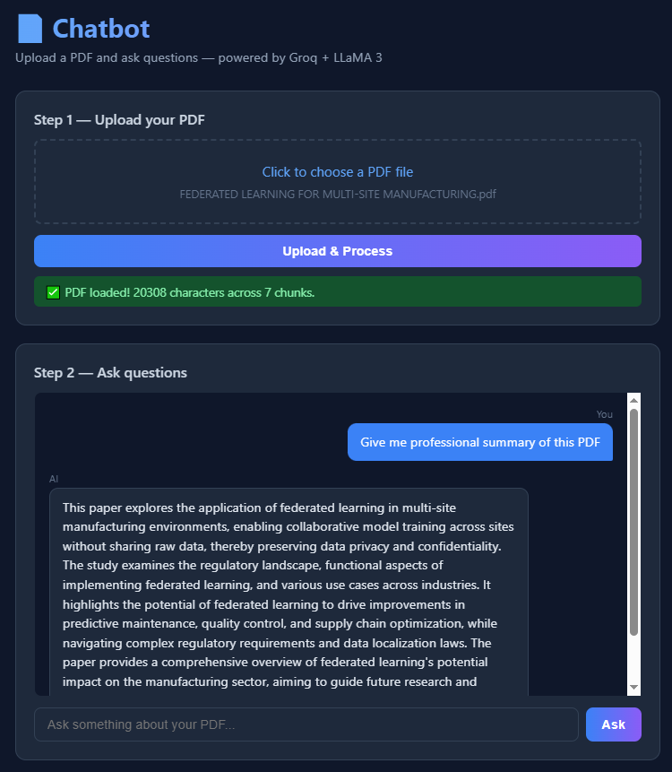

# 📄 PDF RAG Chatbot

A lightweight RAG (Retrieval-Augmented Generation) chatbot that lets you upload any PDF and ask questions about it — powered by **Groq API** and **LLaMA3**.

  

## ✨ Features

- Upload any PDF and extract text instantly
- Ask natural language questions about the document
- Keyword-based chunk retrieval (no vector DB required)
- Fast responses via Groq's LLaMA3-8b model
- Clean dark-mode UI

## 🚀 Getting Started

### 1. Clone the repo
```bash
git clone https://github.com/YOUR_USERNAME/pdf-rag-chatbot.git
cd pdf-rag-chatbot
```

### 2. Install dependencies
```bash
pip install -r requirements.txt
```

### 3. Set your Groq API key
Get a free key at [console.groq.com](https://console.groq.com)

```bash
export GROQ_API_KEY=your_key_here
```

### 4. Run the app
```bash
python app.py
```

Open your browser at `http://localhost:5000`

## 🛠️ How It Works

1. **PDF Upload** — PyMuPDF extracts raw text from the uploaded PDF
2. **Chunking** — Text is split into ~3000 character chunks
3. **Retrieval** — Keyword overlap scoring finds the most relevant chunks for your question
4. **Generation** — Relevant chunks + question are sent to Groq's LLaMA3 model
5. **Answer** — Response is streamed back to the UI

## Here is Screensot of working UI


## 📦 Tech Stack

- **Backend:** Python, Flask
- **LLM:** Groq API (LLaMA3-8b-8192)
- **PDF Parsing:** PyMuPDF (fitz)
- **Frontend:** Vanilla HTML/CSS/JS

## 🔮 Future Improvements

- [ ] Swap keyword retrieval for vector embeddings (ChromaDB)
- [ ] Add conversation memory / chat history
- [ ] Support multiple PDFs
- [ ] Deploy to Hugging Face Spaces or Render

## 👩‍💻 Author

**Inchara S M** — [linkedin.com/in/incharasm](www.linkedin.com/in/inchara-s-m-459aa11a0) | [github.com/IncharaSM](https://github.com/IncharaSM)
"# pdf-rag-chatbot" 
